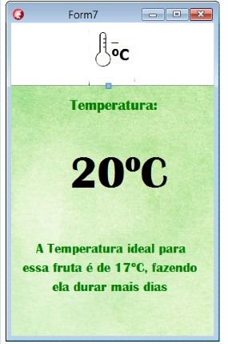

## Seminário de Orientação do Projeto Integrador
CURSO: TECNOLOGIA EM SISTEMAS PARA INTERNET

TEMA: SISTEMA DE GERENCIAMENTO PARA FRUTAS E VERDURAS - PROTOTIPAÇÃO

GRUPO: 
 FERNANDA BEATRIZ TAVARES GOMES

 POLIANA DE ARAUJO PEREIRA

 JONATHAN LEONCIO DE SOUZA LIRA
 
 
 ## Ideia do Projeto

Esse projeto tem o objetivo de realizar analise de dados das frutas e hortaliças, para reduzir o desgaste desses alimentos. Através de um dispositivo para controle dos dados referentes a temperatura, umidade e fluxo de ventilação do ar, como também dados sobre ambiente adequado, transporte e dicas para melhor conservação, essas informações serão apresentadas para os usuários através da exibição no aplicativo.
 
 ## Implementação
 
 ### Diagramas
 #### Diagrama de sequência
 O diagrama de sequência é uma solução dinâmica de modelagem em UML bastante usada porque incide especificamente sobre linhas da vida, ou os processos e objetos que vivem simultaneamente, e as mensagens trocadas entre eles para desempenhar uma função antes do término da linha da vida. Junto com a nossa ferramenta de diagramação UML, use este guia para aprender tudo sobre diagramas de sequência em UML.
 Os diagramas de seqüência em UML são usados, principalmente, para modelar as interações entre os atores e os objetos em um sistema e as interações entre os próprios objetos. A UML tem uma sintaxe rica para diagramas de seqüência, que permite a modelagem de vários tipos de interação. Como não tenho espaço para cobrir todas as possibilidades aqui, concentro-me nos fundamentos desse tipo de diagrama.
  
 
 
 #### Diagrama de Caso de Uso
 
Esse diagrama é responsável por descrever o ponto de vista do usuário do sistema, descrevendo funcionalidades e acessos para cada tipo de usuário. Não é preciso descrever detalhes técnicos, como por exemplo como o sistema será implementado ou o que será feita, mas apenas o que será possui realizar nesse software quando ele estiver implementado. O Diagrama de Caso de Uso é composto por os tipos de usuários (Cliente, Administrador, etc), cenário que é o fluxo/eventos que o usuário poderá acessar, Use Case são as tarefas e funções que o usuário poderá executar e a comunicação das tarefas com os usuários.

Esse diagrama apresenta o fluxo do usuário para acesso ao aplicativo do projeto, o primeiro seria o de login que avançará diretamente para tela de login quando já possui usuário cadastrado, e outro fluxo para cadastrar o usuário, que passará inicialmente pela tela de cadastro para poder ter acesso as demais funcionalidades do software. Posteriamente, esse usuário chegará até o menu da fruta ou hortaliça, para escolher o produto que irá analisar, ao realizar a escolha irá para o menu de dados, para escolher entre: dados da temperatura, umidade e ventilação do ar, exibindo o dado coletado através do dispositivo e também a recomendação adequada para aquele produto. Também terá opções no menu referente a condições do ambiente, condições do transporte e dicas de conservação da fruta/hortaliça escolhida. 

 #### Diagrama de Modelagem do Banco de Dados 
Esse diagrama é responsável por estruturar dados do banco do projeto, incluindo sua estrutura lógica, relações e restrições, capazes de determinar como esses dados serão armazenados e manipulados. Há vários tipos de diagrama nesse contexto: Modelo de banco de dados hierárquico, Modelo relacional, Modelo de rede, Modelo de banco de dados orientado para objetos, Modelo entidade-relacionamento, Modelo documental, Modelo entidade-atributo-valor, Esquema em estrela e outros. Optamos por realizar o diagrama do projeto no Modelo Entidade Relacionamento, em que é baseado no mundo real, as entidades são objetos, que possuem seus atributos e se relacionam entre si.

 

Esse diagrama representa a modelagem do banco de dados que será utilizado para o desenvolvimento do projeto, possuindo duas tabelas de armazenamento de dados. Uma para usuários, com seu nome, email e senha, para realizar cadastro e login no sistema. E outra para os dados dos produtos (frutas e hortaliças), com seu nome, dicas para sua conservação, dados referente a melhor temperatura, umidade e ventilação, como também transporte e ambiente adequado. E essas duas tabelas se relacionam de muitos para muitos, onde muitos usuários podem ter muitas frutas ou hortaliças e muitos produtos podem ter vários usuários.

 ### Desenvolvimento de Dispositivos Móveis
 Consiste no desenvolvimento de um aplicativo (software) responsável por exibir informações ao usuário sobre o nível de maturidade de algumas frutas e hortaliças, através de dados coletados pelo dispositivo em Arduino, dados como temperatura, umidade com recomendação para melhor ambiente, temperatura e umidade adequadas, para a melhor conservação desses alimentos.

Esse aplicativo será desenvolvido em Delphi, no ambiente de desenvolvimento Rad Studio, multiplataforma, podendo ser acessado em qualquer dispositivo, facilitando o acesso para os dispositivos móveis (Celulares, Tablets). Na disciplina estamos aprendendo sobre o desenvolvimento pelo Rad Studio, Delphi, funcionalidades, APIs, Design; e poderemos utilizar tudo isso para o projeto.
 
#### Construção das Interfaces  
 

 ### Programação para internet das coisas
 Será utlizada para o dispositivo em Arduino, conciliado com sensores de umidade e temperatura, para fazer a coleta de dados das frutas e hortaliças, gerenciando controle de amadurecimento e dias de duração, sugerindo melhorias relacionadas a ambiente, transporte, temperatura, umidade e outros fatores. Buscando atráves desse gerenciamento reduzir fatores de aprodrecimento e do desperdicio de frutas e verduras.

 Visando utilizar dos conhecimentos obtidos na disciplina, tais como utilização de Arduino, Sensores, atuadores, conexões, programação, protocolos MQTT, utilizando plataforma como: Tinkercad para simulação, Node Red, Programa do Arduino e outros fatores e funcionalidades.
 
#### Dispositivo:

Para a implementação do dispositivos utilizamos: 
- Arduino Uno
- Placa de Ensaio (Protoboard)
- Sensor DHT11 (Umidade e Temperatura)
- Resistor (10 k Ohms)
- Jumpers/fios (macho-macho)
- Cabo USB para Arduino

Na imagem a seguir, temos o dispositivo Arduino Uno que utilizamos e o sensor DHT11, que é a base do nosso projeto, para coleta de dados da temperatura e umidade, tendo uma faixa de temperatura entre 0ºC a 50ºC e de umidade relativa de 20% UR a 90% UR, e a conexão com cabo USB para carregar o programa apartir do computador.

Fizemos a montagem do DHT11 ao Arduino, com o protoboard, um resistor de 10k Ohms. O DHT11 possui 4 pinos, sendo eles: o primeiro (VCC), sendo ligado a alimentação da placa 5V. O segundo é o de dados, que conectamos ao resistor e também ao pino 2 do Arduino. o terceiro (NC) não é utilizado. e o quarto conectado ao terra (GND).

Utilizamos o modelo de conexão da imagem 2.

#### Implementação:
 
Para a programação do Arduino. Foi necessário para uma nova versão do programa 'Arduino', e duas bibliotecas para a utilização do sensor: a Biblioteca DHT11 e a AdaFruit. 

A seguir, temos o código utilizado para a execução do sensor. E Também a saída respectiva do sensor, apresentando a temperatura e umidade do ambiente.

 ### Teste de software
Em todo projeto ou software é necessário a fase de testes, para o melhor desenvolvimento, buscando falhas, propondo melhorias e a melhor utilização dos usuários. Visto isso, e a forma de desenvolvimento do software, optamos por utilizar O Delphi, no Rad Studio, que é um ambiente que permite encontrar soluções para a proposta de projeto, como também formas integradas de testes nesse aplicativo.

Também será utilizado a fase de teste no dispositivo, visto que o setor de alimentos (frutas e hortaliças), desde o seu cultivo até à sua comercialização ao cliente, nesse percurso há uma série de processos pelo qual exige dados precisos em tempo real por meio de equipamentos de leitura de indicadores de condições climáticas, integrado à IoT. Dessa forma, disponibilizam por meio dos dados que se transformam em informações com mais exatidão na qualidade final desses produtos, evitando possíveis perdas e desperdícios comuns nesse setor de hortifruti. Nesse contexto, a linguagem Delphi é considerada mais apropriada por suportar testes em tempo real e possibilitar facilmente a correção de erros de programação em script de Banco de Dados, APIs, entre outros.

Conhecimentos esses obtidos na disciplina de Teste de Software, referente a ferramenta Rad Studio, como também melhores formas e funcionalidades na realização de testes no aplicativo e etc.

#### Teste Unitários:
Os testes unitários tem por objetivo autenticar pequenas partes do software com base em suas entradas possíveis e saídas esperadas. As unidades usadas nesse tipo de teste sãos as menores partes testáveis de um sistema, normalmente funções, que recebem argumentos e retornam um determinado valor ou efetuam alguma ação cujo resultado pode ser analisado.

Os testes unitários são muito utilizados no TDD (Test Drivem Development), uma metodologia de desenvolvimento que se baseia nos testes para implementar as funcionalidades (ao invés de fazer o contrário, que é mais comum).

#### Teste de componentes:
No teste de componentes, os componentes do software são testados separadamente de acordo com a especificação e estrutura das funcionalidades. Estes componentes são as interações de interface e unidades do software, com diversas classes no seu desenvolvimento. Nessa categoria será avaliada a interação do protótipo das interfaces e, possibilitando a navegação acionando seus botões de interação como comandos essenciais que permitem aos usuário.

além do seu primeiro acesso para registro dos dados pessoais no ato do cadastramento, manter o vínculo com as informações indispensáveis dos produtos e categorias de seu interesse. Tudo isso possível, por meio de uma aplicação desenvolvido em Delphi.

#### Referências:
DevMedia, Testes Unitários. Disponível em: https://www.devmedia.com.br/guia/tecnicas-e-fundamentos-de-testes-de-software/34403. acesso em: 06 ago. 2022

DevMedia, Testes de Componentes. Disponível em: https://www.devmedia.com.br/testes-funcionais-de-software/23565 . acesso em: 08 ago. 2022

LUCIDA (org.). O que é um diagrama de sequência UML?: o que é um diagrama de sequência em uml?. O que é um diagrama de sequência em UML?. 2022. 2022 Lucid Software Inc.. Disponível em: https://www.lucidchart.com/pages/pt/o-que-e-diagrama-de-sequencia-uml. Acesso em: 08 ago. 2022

Sommerville, Ian Engenharia de Software / Ian Sommerville; tradução Ivan Bosnic e Kalinka G. de O. Gonçalves; revisão técnica Kechi Hirama. — 9. ed. — São Paulo: Pearson Prentice Hall, 2011  

